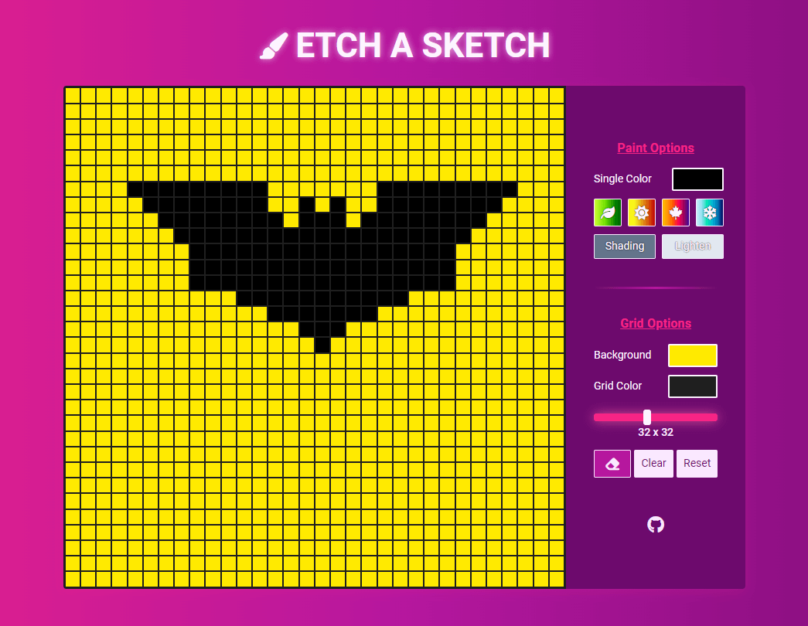

# [Etch-a-Sketch](https://gdimitroff.github.io/etch-a-sketch/)

### Project task

Browser implementation to create Etch-a-Sketch app using HTML, CSS and Vanilla JavaScript from The Odin Project [curriculum](https://www.theodinproject.com/lessons/foundations-etch-a-sketch).

### Outcome

- Deepened knowledge of **DOM** and its **manipulation**.
- Improved **CSS Grid** understanding and usage.
- Greatly improved **functionality** in general.
- Instead of user prompt, grid size can be changed dynamically for **better UX** and **UI**.
- Understanding how **touch** events works.
- Deepened knowledge of **color usage**.

